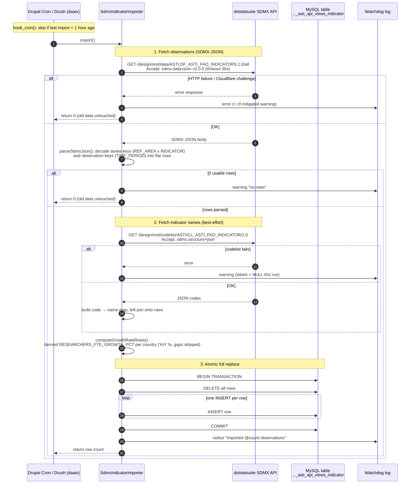

# dotStat Suite ASTI/FAOSTAT Agricultural R&D Indicators (Views)

A Drupal 11 module that shows agricultural R&D statistics (researchers,
R&D expenditure) for 134 countries from the dotstatsuite SDMX API
(`ASTI:DF_ASTI_FAO_INDICATORS`) as a data table and four Chart.js charts
at `/dotstatsuite_asti_api_views`.

The core idea: **never call the remote API while a page is loading**. A
background sync copies the data into a local SQL table; Views reads only
that table. If dotstatsuite is down, the page keeps showing the last synced
data — just older.

Renamed and rebuilt from `tapipedia_dotstatsuite_asti_kenya_api_views`
(the sibling module for `ASTI:DF_ASTI_AG_RESEARCH`, Kenya only) to target
this larger, multi-country dataflow. See ADR-7 for what changed and why.

## How data flows

```mermaid
flowchart LR
    subgraph remote["dotstatsuite SDMX API"]
        D["/design/rest/data/ASTI,DF_ASTI_FAO_INDICATORS,1.0/all<br/>(observations, SDMX-JSON 2.0.0)"]
        C["/design/rest/codelist/ASTI/CL_ASTI_FAO_INDICATOR/1.0<br/>(indicator names, JSON)"]
    end

    T1[hook_cron, max 1x/hour] --> IMP
    T2["drush daaiv (manual)"] --> IMP

    subgraph sync["SdmxIndicatorImporter::import()"]
        IMP[Fetch SDMX-JSON] --> P["parseSdmxJson(): decode series/observation<br/>keys via dimensions.series/observation"]
        C2[Fetch codelist<br/>best-effort] --> J["Join indicator labels<br/>(NULL if codelist fails)"]
        P --> J
        J --> G["Add derived series per country:<br/>RESEARCHERS_FTE_GROWTH_PCT<br/>(YoY % change)"]
        G --> L["Transaction: DELETE + INSERT<br/>(atomic full replace)"]
    end

    D --> IMP
    C --> C2
    L --> DB[("dotstatsuite_<br/>asti_api_views_indicator<br/>one row per country/indicator/year")]

    DB --> V["Views: base table via hook_views_data()"]
    V --> TB["Table display<br/>(sortable, exposed country/indicator/year filters, pager)"]
    V --> CH["4 chart blocks (default: Kenya)<br/>style plugin: dotstatsuite_chartjs"]
    CH --> RS["drupalSettings<br/>(chart config inlined in page HTML)"]
    RS --> JS["js/views-chartjs.js<br/>renders Chart.js on canvas"]
```

## Why JSON, not CSV

The sibling modules fetch `Accept: application/vnd.sdmx.data+csv`. This
dataflow's CSV export returns **HTTP 500** for every query shape tried
(full dataset, single country, single series) — traced to a data-quality
artifact in the uploaded data: the `UNIT_MEASURE` attribute holds an
unexpected value `"No"` (alongside the expected `"million USD"`), likely a
column-misalignment from the source FAOSTAT extract. The dataflow's JSON
export is unaffected, so `SdmxIndicatorImporter::parseSdmxJson()` walks the
SDMX-JSON 2.0.0 `dimensions.series` / `dimensions.observation` structure
directly instead of parsing flat CSV rows. This is a workaround for the
upstream data, not a fix — a clean re-upload of this dataflow on the
dotstatsuite side would let a future version go back to CSV if desired.

## How the sync works (sequence diagram)

Main pieces:

| File | Role |
|---|---|
| `src/SdmxIndicatorImporter.php` | The sync: fetch SDMX-JSON, parse, label-join, derive per-country growth rate, load. Never throws — failures are logged and old data is kept. |
| `.install` | Schema for the local table (one row per country/indicator/year, 134 countries). |
| `.module` | `hook_cron()` (throttled hourly sync) + `hook_views_data()` (exposes the table to Views with core handlers only). |
| `src/Plugin/views/style/ChartJs.php` | Views format plugin (`dotstatsuite_chartjs`): pivots result rows into Chart.js datasets (X field, series field, Y field, optional dual axis) — all configurable in the Views UI. |
| `js/views-chartjs.js` + `css/` + `lib/chartjs/` | Client-side rendering of the chart config from `drupalSettings`. |
| `config/install/views.view.*.yml` | The shipped View: table page (exposed country/indicator/year filters) + 4 Kenya-default chart blocks (researchers trend, year comparison, growth rate, expenditure). |
| `src/Drush/Commands/...` | `drush dotstatsuite-asti-api-views:import` (alias `daaiv`) for manual syncs. |

## Access: works for anonymous users

The public page requires no login. Concretely:

- The View's access plugin is `perm: 'access content'` — the permission
  anonymous visitors already have.
- The remote API fetch happens in **cron or Drush**, i.e. server-side with
  no user in the loop. Anonymous visitors never trigger an API call.
- Charts need no authenticated AJAX either: the style plugin inlines the
  chart data into the page HTML via `drupalSettings`, and
  `js/views-chartjs.js` draws it locally.
- Views caching works normally: the `user.permissions` cache context gives
  anonymous and authenticated users their own cached variants.

So an anonymous visitor always sees the last synced data, rendered entirely
from the local database.

## ADRs

### ADR-1: Mirror the API in a local table instead of calling it per request

- **Status:** accepted
- **Context:** The page needs decades of observations across many
  countries and indicators. The upstream API sits behind Cloudflare, can be
  slow, and can go down or serve bot challenges.
- **Decision:** Sync into a local SQL table (hourly via cron, manual via
  Drush). Views queries only the local table.
- **Consequences:** Page latency and uptime are decoupled from dotstatsuite;
  Views can filter/sort/paginate in SQL. Cost: data can be up to 1 hour
  stale, and sync failures are silent to visitors (mitigated by watchdog
  logs).

### ADR-2: Atomic full replace, not incremental upsert

- **Status:** accepted
- **Context:** The dataflow is moderate-sized (134 countries, 3 indicators,
  yearly) and the API is authoritative for the whole series.
- **Decision:** Each import does `DELETE` + `INSERT` of all rows inside one
  transaction. `DELETE`, not `TRUNCATE`, because MySQL auto-commits TRUNCATE
  mid-transaction — a failed INSERT would otherwise leave the table empty
  for live readers.
- **Consequences:** Readers never see partial or mixed data; no stale-row
  reconciliation logic needed. Cost: re-imports ~4,000 rows hourly (cheap at
  this scale).

### ADR-3: Failures are logged, never thrown; graceful degradation layers

- **Status:** accepted
- **Context:** The sync runs in cron and must not break other cron work or
  wipe good data.
- **Decision:** `import()` catches everything and returns 0, leaving existing
  rows in place. Label fetching has its own try/catch inside the import: a
  codelist outage only drops labels for that run (labels become `NULL`), it
  cannot fail the data sync. A distinct log line flags Cloudflare challenges
  (`cf-mitigated` header) so "we were blocked" is distinguishable from "API
  broken".
- **Consequences:** Maximum availability of the displayed data. Cost:
  staleness is invisible on the page — monitoring must watch watchdog.
  Note: charts filter on `indicator_label`, so if the last import ran
  without labels those chart series vanish until a label fetch succeeds;
  matching on the `indicator` code would be more robust.

### ADR-4: Derive the growth-rate series at import time, per country

- **Status:** accepted
- **Context:** One chart needs YoY % change in researcher FTEs; the API
  doesn't provide it. Unlike the sibling Kenya-only module, this dataflow
  covers 134 countries, so the derivation can't assume a single country.
- **Decision:** `computeGrowthRateRows()` groups observations by
  `ref_area` first, then computes `RESEARCHERS_FTE_GROWTH_PCT` per country
  during import and stores it as ordinary rows — only across consecutive
  years within that country, skipping gaps, never dividing by zero.
- **Consequences:** Charts treat it like any real indicator with zero
  special-casing in the Views plugin, for any country. Cost: derived rows
  live next to raw data; the fake `indicator` code must stay unique per
  country/year pair (it is, since `ref_area` is part of the row).

### ADR-5: A generic Chart.js Views *style* plugin instead of custom blocks

- **Status:** accepted
- **Context:** The webmaster should be able to create and tweak charts
  without a developer.
- **Decision:** `dotstatsuite_chartjs` is a fields-based style plugin (like
  Table): pick an X-label field, a series field, a value field, optional
  comma-separated series for a right-hand secondary axis. The plugin pivots
  rows into datasets and hands a `<canvas>` + `drupalSettings` config to the
  theme layer (no Twig, since a chart isn't rows of markup). Chart.js is
  vendored locally in `lib/`.
- **Consequences:** Any query on this table can become a chart purely in the
  Views UI; charts work for anonymous users since the config ships inside
  the cached page HTML. Cost: one shared palette/behaviour — heavily custom
  visuals would still need code.

### ADR-6: Independent copy of the sync, not shared with sibling ASTI modules

- **Status:** accepted
- **Context:** `tapipedia_dotstatsuite_asti_kenya` and
  `tapipedia_dotstatsuite_asti_kenya_api_views` each sync their own
  (different) dataflow into their own tables.
- **Decision:** This module keeps its own importer, table, cron state and
  Views, with fully prefixed names.
- **Consequences:** Any of these modules can be enabled, changed, or
  uninstalled without touching the others. Cost: each fetches and stores
  its own data independently — acceptable duplication for lifecycle
  independence.

### ADR-7: Renamed from `tapipedia_dotstatsuite_asti_kenya_api_views`, retargeted at a bigger dataflow

- **Status:** accepted
- **Context:** This module started as a copy of
  `tapipedia_dotstatsuite_asti_kenya_api_views` (Kenya-only,
  `ASTI:DF_ASTI_AG_RESEARCH`), renamed and retargeted at
  `ASTI:DF_ASTI_FAO_INDICATORS` (134 countries) for the `demo-asti`
  Drupal site.
- **Decision:** Full rename (module machine name, table, service, logger
  channel, Drush command, style plugin id, JS behavior) rather than a
  fork-in-place with the old name — avoids confusion between the two
  otherwise near-identical modules if both are ever installed side by
  side. The importer's CSV fetch was replaced with SDMX-JSON parsing (see
  "Why JSON, not CSV" above) since this dataflow's CSV export is broken
  upstream. The growth-rate derivation was generalized from a hardcoded
  single country to per-country grouping, since the new dataflow isn't
  single-country. The main table view gained an exposed country filter
  (not needed on the old Kenya-only table); the 4 chart blocks keep a
  hardcoded `ref_area = KEN` default filter for continuity with the
  sibling Kenya-focused modules on this site, editable via Structure >
  Views like any other filter.
- **Consequences:** Both modules could coexist on the same site without
  collision. Cost: some duplicated boilerplate between the two modules
  (acceptable — see ADR-6's reasoning for why they aren't shared).
